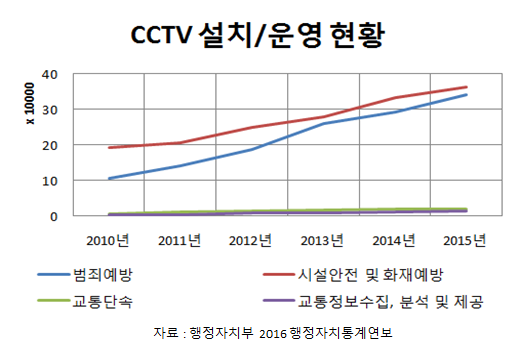

# MULTICAMPUS-1st-project

방범시설 위치정보 분석을 통한 **방범 사각지대 분석·시각화** (`Spring Framework`, `Maps API`, `R`, `Oracle`, geometry eq.,  )

:link:[프로젝트 프리젠테이션](doc/Outliers_Final.pdf)

## 개요

### 기획 동기

최근 범죄 경향을 보면 절도 등의 계획성 범죄는 줄어들고 폭력 등의 우발성 범죄들이 늘어나는 추세이다. 또한 우발성 범죄의 경우 범인검거에 CCTV 등의 무인 방범시설들의 역할이 중요함을 파악할 수 있다.

이러한 이유로 CCTV를 더욱 효율적으로 운용할 수 있도록 범죄 예방 및 사후관리, 시설안전 및 화재예방에 도움을 주고자 프로젝트를 기획하였다.

### Methodology

- MAPs API 및 공공데이터 포털에서 수집한 데이터로  경찰서/CCTV 정보를 지도위에 표시한다.

- 방범시설 위치정버를 분석 사각지대로 예측되는 지역을 색상으로 확인할 수 있도록 한다.

- 기타 사항으로 각 구의 5대 범죄 현황을 그래프 및 차트로 표시한다.

## 사용 기술

- Spring Framwork

  Backend 구현

- Kakao Maps API

  방범시설 표시 및 지역 검색 기능, 구별 구분 기능

- R statistics

  범위내 방범시설 갯수에 따른 색상 적용 및 시각화 이미지 생성

- Oracle DBMS

  위치 데이터 CRUD

- geometry eq.

  위도/경도에 따른 정확한 좌표 변환을 통한 2D 맵과의 동기화

 ## 구현 내역

### 서버 구성

### 방범 사각지대 시각화

### 서울시 구별 범죄 통계

## 구현된 웹 어플리케이션 UI 및 기능

### intro page

### 방범시설 위치 정보 시각화

### 방범 사각지대 시각화

### 각 구별 범죄 통계 정보

## 결과

프로젝트 수행 평가 만점

